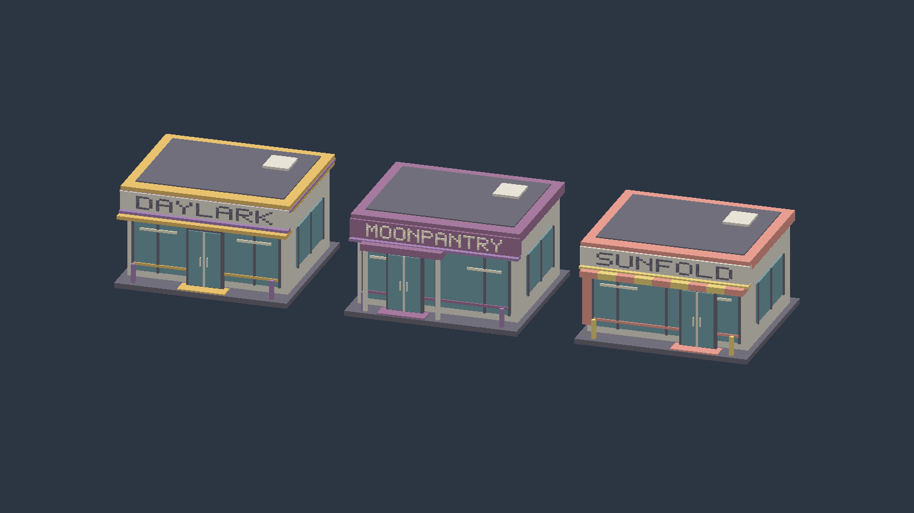
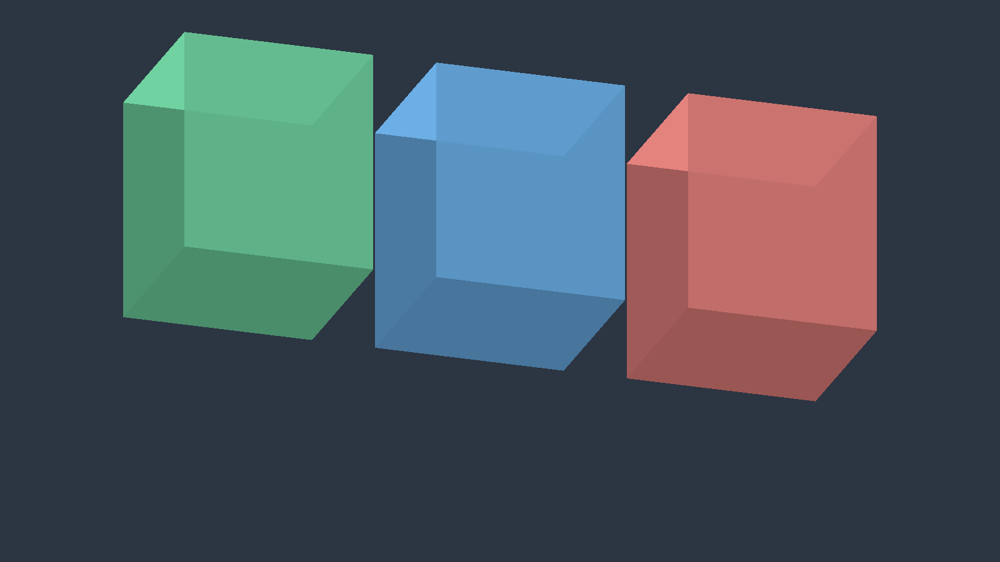

# Three original convenience-store brands

## Intent

Create three recognizable convenience-store silhouettes inspired by Japanese
chain archetypes, using original names, colors and signage. No source-chain
logo or lettering is reproduced. These are working game brands, not a claim
of trademark availability.

| Legacy simulation ID | Display name | Motif | Palette | Architecture |
|---|---|---|---|---|
| Losan | MOONPANTRY | Lawson: quiet neighborhood presence | Plum / cream | Recessed-looking left entrance, deep porch, paired columns |
| Famoma | SUNFOLD | FamilyMart: open and approachable | Coral / yellow | Right entrance, alternating awning, vertical end-cap |
| SebanIleban | DAYLARK | Seven-Eleven: continuous horizontal fascia | Amber / violet | Center entrance, wraparound bands, broad canopy |

## Storefront geometry

`buildStoreMarkerGeometry` consumes the existing immutable store snapshot and
delegates each facade to `storefront_geometry`. Buildings have a raised plinth,
flat roof with vent, opaque stylized glazing, framed double doors with handles,
side windows, bollards, and actual 5x7 mesh lettering. Positive Z is the front.
Default footprint is 6 x 5.7 meters; total height is 3.6 meters. All components
scale with the existing marker spec, including placement animation.

Names and colors are presentation changes. Stable chain IDs, save data,
placement rules and economic balance retain their existing contracts.

## Comparison delivery

Use Pictor to render a three-store lineup and individual front three-quarter
views. Record camera, resolution, lighting, and revision so Fable/Claude's
alternative can later be compared under the same conditions. Compare identity
at game zoom, sign readability, facade detail, silhouette and geometry cost.
Do not label a software-rendered illustration as a Pictor capture.

`konbini_store_gallery` is the Pictor/Ergo presentation-only executable. Build
with `KONBINI_BUILD_RENDER=ON`, `KONBINI_BUILD_FIGMENTUM_ADAPTER=OFF`, and
`KONBINI_BUILD_TESTS=OFF`; target `konbini_store_gallery`. Launch service
`kd-store-gallery` through Excubitor from the main project folder. It exports
lineup / DAYLARK / MOONPANTRY / SUNFOLD / FABLE-CURRENT / TOWER-30 /
TOWER-DETAIL after eight frames each, then exits.
The output is `build/store-gallery/*.ppm`, P6 RGB with linear HDR converted to
sRGB. PNG copies preserve these exact pixels; HUD is excluded from readback.
The initial window is 1600 x 900. Camera azimuth/elevation are 72/22 degrees;
vertical span is 17 meters for the lineup and 8 meters for individual views.
Lighting uses the unchanged KD world shader. Storefronts use the opaque depth
pipeline; translucent marker alpha is no longer used for these solid buildings.

## Captured result — 2026-09-07

[DAYLARK](store-gallery/DAYLARK.png) / [MOONPANTRY](store-gallery/MOONPANTRY.png) /
[SUNFOLD](store-gallery/SUNFOLD.png)

The gallery target built successfully in Release with tests disabled. The
four images were exported from the Pictor world color attachment at 1600 x 900,
visually inspected, and losslessly encoded as PNG. Capture ran through
Excubitor with a Cc claim from the main project folder; the process exited
automatically. The temporarily staged catalog was restored and the claim
released. No unit/integration suite or full-game validation was run.

## Current Fable comparison

neco identified the current implementation as the Fable version. The reference
is frozen from main `4678511` (`store_marker_geometry.cpp` and
`world_palette.cpp`): a 6 x 6 x 7 meter box with alpha 0.85, no lettering,
door or window, 24 vertices / 12 triangles per store. The comparison gallery
preserves those dimensions, colors and overlay depth/blend behavior, using
the same camera, light, background and viewport as the new lineup.

| Aspect | Current Fable | New storefronts |
|---|---|---|
| Purpose conveyed | Chain-colored placement markers | Recognizable convenience stores |
| Chain identity | Color only | Name, color, entrance position, canopy |
| Geometry cost | 12 triangles/store | More geometry for facade details and lettering |
| Depth | Transparent overlay without depth write | Opaque, self-occluding parts |
| Tower use | Repeated blocks | Repeated shops with readable fascia |

The current markers suit an inexpensive distant representation. Use the new
storefronts for the requested tower, where repeated shop identity is the goal.
Performance was not benchmarked, and the reference comparison concerns store
appearance only, not a comparison of the complete games.

The comparison informed the completed
[30-floor convenience-store tower](thirty-floor-store-tower.md).
